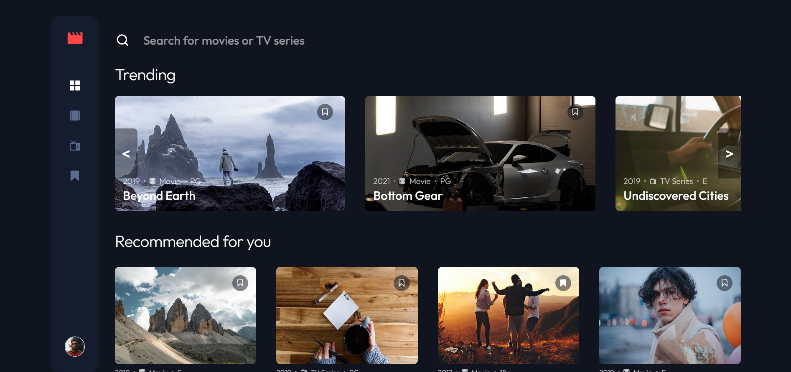

# Frontend Mentor - Entertainment web app solution

This is a solution to the [Entertainment web app challenge on Frontend Mentor](https://www.frontendmentor.io/challenges/entertainment-web-app-J-UhgAW1X). Frontend Mentor challenges help you improve your coding skills by building realistic project.

### The challenge

Users should be able to:

-   View the optimal layout for the app depending on their device's screen size
-   See hover states for all interactive elements on the page
-   Navigate between Home, Movies, TV Series, and Bookmarked Shows pages
-   Add/Remove bookmarks from all movies and TV series
-   Search for relevant shows on all pages

### Screenshot

### Links

-   Solution URL: [GitHub](https://github.com/MarcinFiuk/movies-entertainment-app)
-   Live Site URL: [Vercel](https://movies-entertainment-app-marcinfiuk.vercel.app/bookmarked)

## My process

### Built with

-   [TypeScript](https://www.typescriptlang.org/)
-   [React](https://reactjs.org/)
-   [Styled Components](https://styled-components.com/)
-   [Nuka Carousel](https://github.com/FormidableLabs/nuka-carousel)

## Author

-   Frontend Mentor - [@MarcinFiuk](https://www.frontendmentor.io/profile/MarcinFiuk)
-   Twitter - [@marcin_fiuk](https://twitter.com/marcin_fiuk)
-   LinkedIn - [Marcin Fiuk](https://www.linkedin.com/in/marcin-fiuk-0b498b241/)
